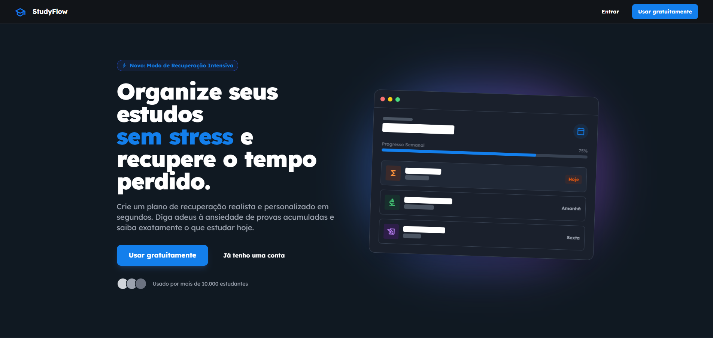
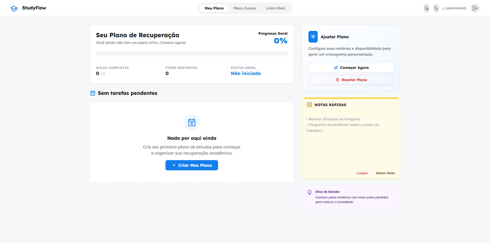
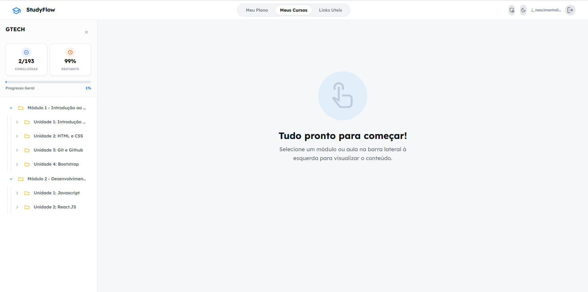
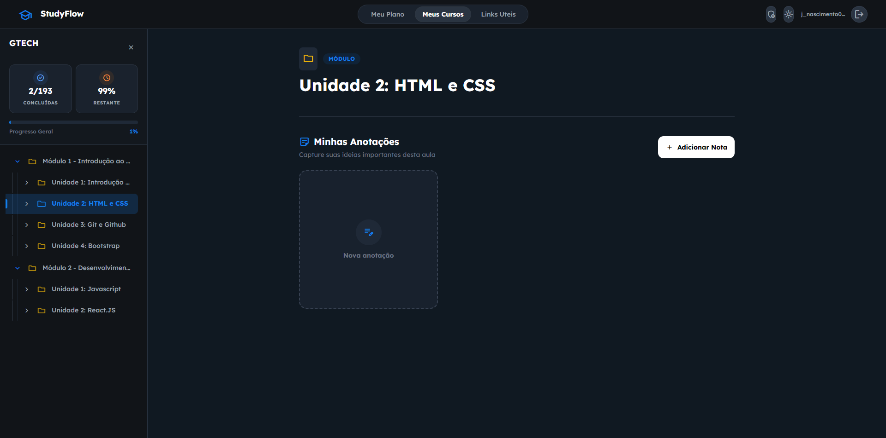

# StudyFlow 🎓

> **Seu companheiro de recuperação acadêmica.**  
> O StudyFlow é um assistente de estudos inteligente, projetado para ajudar estudantes a organizar sua vida acadêmica, recuperar conteúdos perdidos e manter a motivação.

---

## 📸 Demonstração

<!-- ADICIONE SUAS IMAGENS AQUI -->
<!-- Exemplo:  -->

| Dashboard | Planejador |
|:---:|:---:|
| ** | ** |

| Cursos | Modo Escuro |
|:---:|:---:|
| ** | ** |

---

## ✨ Funcionalidades Principais

### 📊 Dashboard Inteligente
*   **Visão Geral:** Acompanhe seu progresso de recuperação em tempo real.
*   **Cronograma Semanal:** Veja as tarefas e aulas que você precisa completar na semana.
*   **Notas Rápidas:** Um widget prático para salvar lembretes e ideias rápidas.

### 📅 Planejador de Estudos (AI Powered)
*   **Geração Automática:** Crie planos de estudo personalizados com base nas suas matérias atrasadas e disponibilidade.
*   **Integração com IA:** Utiliza o **Google Gemini 2.0 Flash** para estruturar tópicos e sub-tópicos de estudo de forma lógica.
*   **Gestão de Rotina:** Defina seus horários de "Deep Work" e intervalos.

### 📚 Área de Cursos
*   **Player de Aulas:** Interface imersiva para assistir aulas e consumir conteúdo.
*   **Estrutura em Árvore:** Navegação fácil entre módulos, lições e quizzes através de uma sidebar responsiva.
*   **Anotações Contextuais:** Faça anotações específicas para cada aula com timestamp (ex: 05:30) e cores personalizadas.
*   **Rastreamento de Progresso:** Marque aulas como concluídas e veja a barra de progresso avançar.

### 🛠️ Painel Administrativo
*   **Gestão de Conteúdo:** Crie e edite cursos, módulos e lições.
*   **Organização:** Arraste e solte (conceitual) para organizar a estrutura do curso.

### 🎨 UI/UX Moderna
*   **Design Responsivo:** Funciona perfeitamente em Desktop e Mobile.
*   **Temas:** Suporte nativo a **Light Mode** e **Dark Mode**.
*   **Animações:** Transições suaves e micro-interações para uma experiência fluida.

---

## 🚀 Tecnologias Utilizadas

Este projeto foi construído com as tecnologias mais recentes do ecossistema web:

*   **Frontend Check:**
    *   [React 19](https://react.dev/) - Biblioteca UI.
    *   [Vite](https://vitejs.dev/) - Build tool ultra-rápida.
    *   [TypeScript](https://www.typescriptlang.org/) - Tipagem estática para código robusto.
    *   [Tailwind CSS](https://tailwindcss.com/) - Estilização utilitária.
    *   [React Router 7](https://reactrouter.com/) - Roteamento.

*   **Backend & Serviços:**
    *   [Supabase](https://supabase.com/) - Backend-as-a-Service (Banco de dados, Auth).
    *   [Google Gemini AI](https://ai.google.dev/) - Inteligência Artificial para geração de planos.

---

## 📦 Como Rodar o Projeto

1.  **Clone o repositório:**
    ```bash
    git clone https://github.com/seu-usuario/studyflow.git
    cd studyflow
    ```

2.  **Instale as dependências:**
    ```bash
    npm install
    # ou
    yarn install
    ```

3.  **Configure as Variáveis de Ambiente:**
    Crie um arquivo `.env` na raiz do projeto e adicione suas chaves:
    ```env
    VITE_GEMINI_API_KEY=sua_chave_aqui
    VITE_SUPABASE_URL=sua_url_supabase
    VITE_SUPABASE_ANON_KEY=sua_chave_anon_supabase
    ```

4.  **Rode o servidor de desenvolvimento:**
    ```bash
    npm run dev
    ```

5.  **Acesse:**
    Abra `http://localhost:5173` no seu navegador.

---

## 📝 Licença

Este projeto está licenciado sob a licença MIT.  
Sinta-se à vontade para usar, estudar, modificar e compartilhar para fins educacionais.
